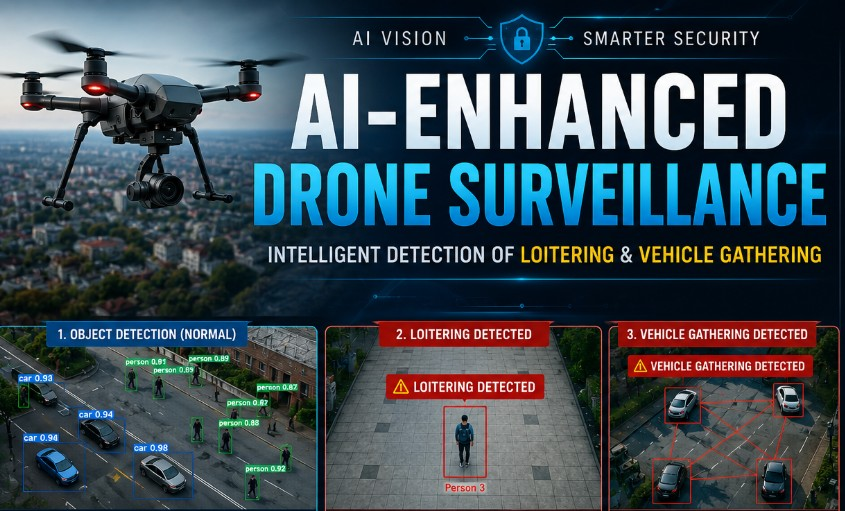
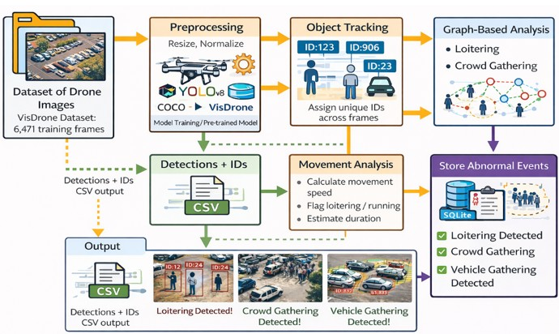
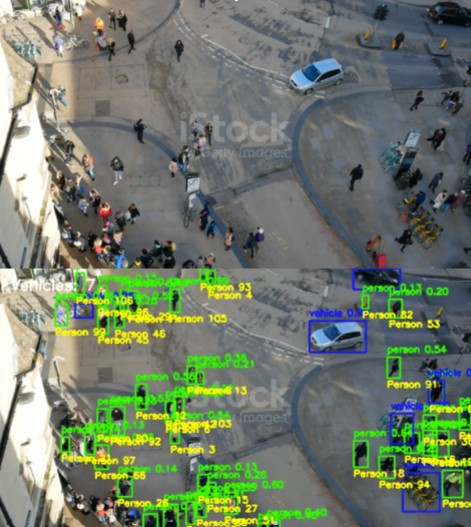
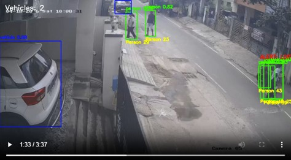
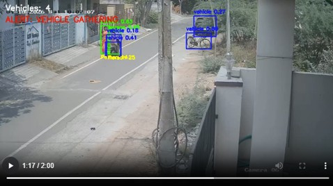
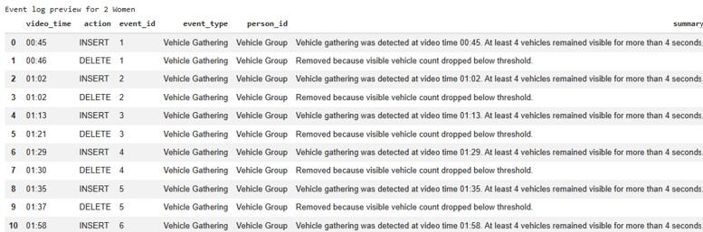
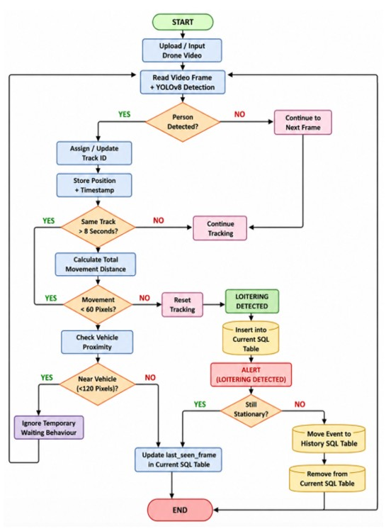
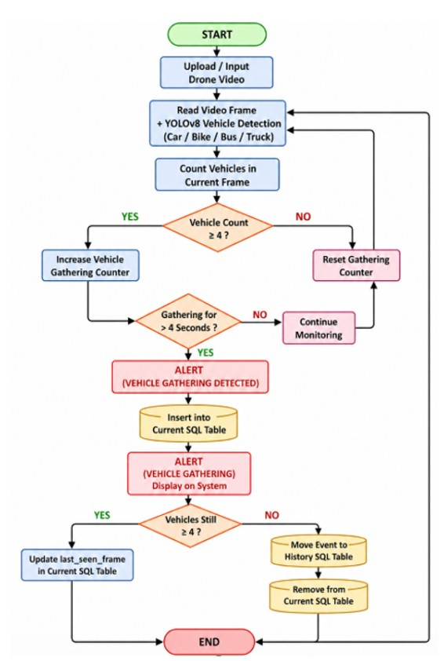

# 🚁 AI Drone Surveillance System



An AI-powered surveillance solution that performs real-time object detection, loitering analysis, and vehicle gathering detection using computer vision, deep learning, and graph-based analytics.

---

## 📌 Project Overview

Traditional surveillance systems can detect objects but often struggle to understand suspicious behaviour and contextual events.

This project extends object detection by analysing movement patterns and spatial relationships to identify:

- 👤 Suspicious loitering behaviour
- 🚗 Vehicle gathering events
- 📡 Real-time surveillance activities
- 🗄️ Event history logging for forensic review

The system combines object detection, object tracking, behavioural analysis, and event logging to transform surveillance footage into actionable intelligence.

---

## 🎯 Key Features

### 👤 Loitering Detection

- Real-time person detection using YOLO
- Multi-object tracking across video frames
- Movement pattern analysis
- Detection of prolonged stationary behaviour
- Automated suspicious activity identification
- Human-readable event history generation

### 🚗 Vehicle Gathering Detection

- Real-time vehicle detection and tracking
- Graph-based spatial relationship analysis
- Automatic group formation detection
- Vehicle gathering event generation
- Real-time visual monitoring

### 📊 Event History System

- Human-readable SQL event logs
- Timestamp-based records
- Event duration tracking
- Historical event review
- Forensic investigation support

---

## 🏗️ System Architecture

The architecture combines object detection, tracking, behavioural analysis, graph analytics, and event logging into a unified surveillance pipeline.



---

## 📸 Sample Outputs

### Person Detection

Real-time person detection using YOLO object detection.



---

### Loitering Detection

A person remaining within the same region for longer than the configured threshold is flagged as suspicious and recorded in the event history.



---

### Vehicle Gathering Detection

Graph-based spatial analysis is used to identify groups of vehicles forming a gathering event.



---

### Event History Dashboard

Human-readable event logging containing timestamps, event type, duration, and status information for forensic review.



---

## 🔄 Loitering Detection Workflow

The system continuously monitors tracked individuals and analyses movement behaviour to identify prolonged stationary activity.



---

## 🚗 Vehicle Gathering Detection Workflow

The system analyses vehicle proximity relationships and detects group formations using graph-based analytics.



---

## 💡 Applications

- Smart City Surveillance
- Airport Monitoring
- Campus Security
- Parking Lot Monitoring
- Critical Infrastructure Protection
- Public Event Monitoring
- Drone-Based Surveillance Systems

---

## 🛠️ Technologies Used

- Python
- YOLO
- OpenCV
- SQLite
- Deep Learning
- Computer Vision
- Graph-Based Analytics

---

## 📈 Future Improvements

- Multi-camera integration
- Live drone deployment
- Edge AI optimisation
- Mobile monitoring dashboard
- Cloud-based event management
- Real-time notification system
- Large-scale surveillance deployment

---

## 📂 Repository Structure

```text
AI-Drone-Surveillance-System
│
├── README.md
├── drone.py
│
├── assets
│   ├── cover.jpg
│   ├── architecture.jpg
│   ├── person_detection.jpg
│   ├── loitering_detection.jpg
│   ├── vehicle_gathering.jpg
│   ├── event_history.jpg
│   ├── loitering_flowchart.jpg
│   └── vehicle_gathering_flowchart.jpg
│
└── docs
```

---

## 👨‍💻 Author

**Shivani**

Master's Research Project

Auckland University of Technology (AUT)

---

## 🙏 Acknowledgements

Special thanks to **Professor Peter Chong** and **Auckland University of Technology (AUT)** for their guidance and support throughout this research project.

---

## 📬 Connect With Me

If you are interested in AI, Computer Vision, Drone Surveillance, IoT, Networking, or Embedded Systems, feel free to connect and collaborate.

⭐ If you found this project interesting, consider giving the repository a star.
